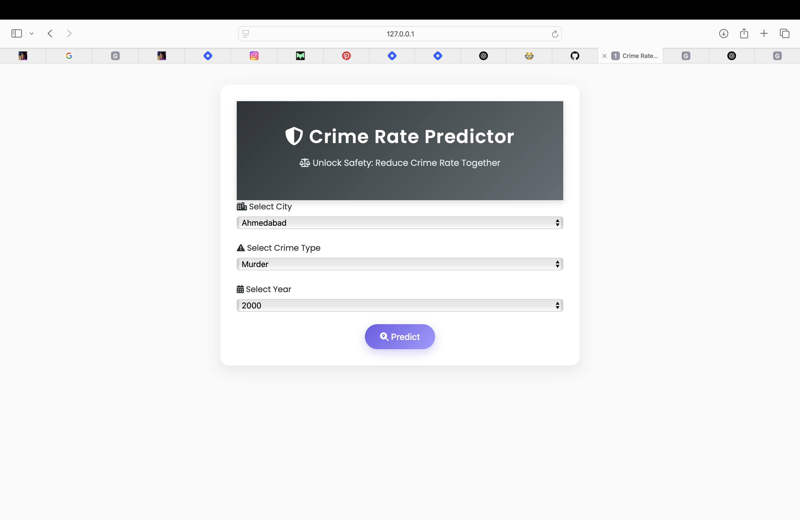

<h1 align="center">🔐 Crime Rate Predictor</h1>

<p align="center">
  💻 A Machine Learning + Flask web app to predict crime trends and risk levels across Indian cities.  
</p>

<p align="center">
  
</p>

---

## 🧠 What It Does

✨ Predicts **crime rate** & **expected number of cases**  
✨ Classifies **crime risk level** (like Very High, Moderate, Safe)  
✨ Shows **radar chart** of various crime types  
✨ Suggests **safety tips** and **nearby police stations**

---

## 🛠️ Built With

| Layer      | Tech Stack                             |
|------------|----------------------------------------|
| 💅 Frontend | HTML, CSS, Font Awesome, Chart.js       |
| 🧠 Backend  | Python + Flask                         |
| 📈 ML Model | scikit-learn (KNN)                     |
| 🧪 Data     | CSV preprocessing + joblib models      |

---

## 🚀 Run It Locally

```bash
# 1. Clone this repo
git clone https://github.com/roshnimalhotra/CrimeRate-Predictor.git
cd CrimeRate-Predictor

# 2. Install dependencies
pip install -r requirements.txt

# 3. Run Flask app
python app.py

# 4. Visit in browser
http://127.0.0.1:5000/
```
## 📁 Folder Peek
<pre> CrimeRate-Predictor/
├── app.py
├── crime prediction.ipynb
├── knn_model.joblib
├── scaler_X.joblib
├── processed_crime_data.csv
├── requirements.txt
│
├── templates/
│   ├── index.html
│   └── result.html
│
├── static/
│   └── styles.css, main.js
│
└── README_assets/
    └── resultpage.png
</pre>

## 🛡️ Future Vibes

- 🗺️ Add city-wise interactive crime maps  
- 📲 Make the UI mobile responsive  
- 🔐 Add login & report system for citizens  
- 📡 Connect to real-time crime data APIs  

## 👩🏻‍💻 About Me
- Hey! I'm Roshni Malhotra — a BCA grad 🌸 exploring the space between AI, web dev & aesthetics.
- ✨ Building mood-driven, safety-aware projects
- 🌐 Instagram: @roshniicreates
- Let’s turn ideas into impact 🫶

## 🌟 Show Some Love
If you found this helpful, drop a ⭐ on the repo — it makes my day!
